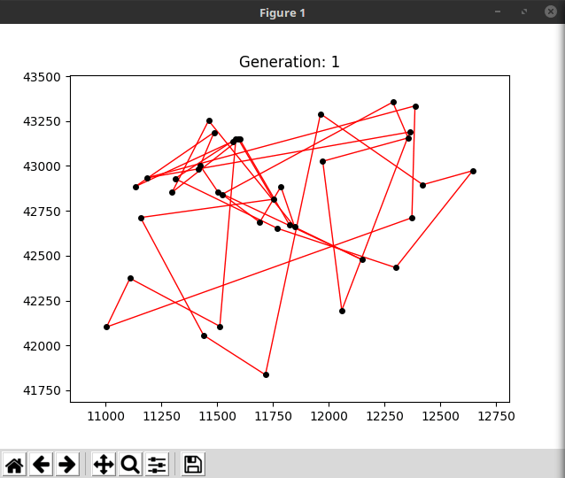
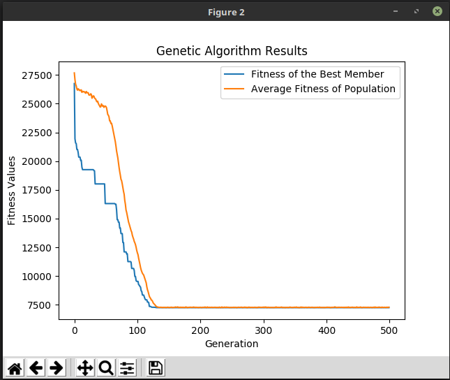

# Genetic Algorithm

As the traveling salesman is classed as an NP-Complete, is it extremely computationally expensive to derieve an optimal solution. A better approach is often to use a meta-heuristic algorithm such as a genetic algorithm to approximate a near optimal solution, rather than a perfectly optimal one. This program works by randomly initializing a population of individual tsp paths, and gradually evolving the population though a mix of mutations and the process of evolution. The program will graphically display the most fit individual of the population as it evolves. After the evolution, the program will  produce a graph, plotting best_member and average_population data tracked throughout the evolution process. This repository showcases a genetic algorithm applied to the traveling salesman problem. 

### Demonstration

### Fitness Result

### Usage

Set the GA paremeters inside GeneticAlgorithm.py, and run the file. Matplotlib is required if graphics are desired.

### Parameters

##### Seed

A seed can be specified by the user if looking to reproduce specific results, by default the program will generate one at random.

##### K

K is the value used by the selection algorithm. Tournament selection was opted for, in which K-individuals are selected amongst the population to compete in a tournament for a chance at reproduction.

##### max_gen

The number of generations the GA should run for. Reproduction will occur Max_Gen - 1 times.

##### pop_size

The size of the population to use.

##### elitism

The number of the population's most elite individuals to copy into the next population directly. If noelitism is desired, this number can be manually set to 0.

##### x_type

The type of genetic crossover to use. Specifies how reproduction is undergone. The program supports ordered crossover, and uniform-crossover.

##### m_type

The mutation mechanism to be used. Currently only supports reciporical exchange mutation, as this was the one that seemed to produce the best results.

##### x_chance

The chance crossover will occur.

##### m_chance

The chance a mutation will occur.

##### file name

The name of the data file containing the tsp data to be used. Should have a similar format to the example files provided.